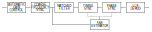

# Phase4 Receiver Development

This stores the documentation of the Phase4 receiver development.

## Architecture

## Documentation

Full documentation can be found here: [phase4space.github.io/receiver-development](https://phase4space.github.io/receiver-development).

## TODO

**Timing Synchronisation**
- [x] topology selection - __polyphase combined matched filtering__
- [x] ideal Python model
- [x] stability analysis
- [x] performance measurement

**Automatic Gain Control**
- [ ] topology selection
- [ ] ideal Python model
- [ ] performance measurement

**Coarse Frequency Sync**
- [ ] topology selection
- [ ] ideal Python model
- [ ] performance measurement

**Phase Sync**
- [ ] topology selection
- [ ] ideal Python model
- [ ] performance measurement

**LLR Demod**
- [ ] topology selection
- [ ] ideal Python model
- [ ] performance measurement

**SNR Estimation**
- [ ] topology selection
- [ ] ideal Python model
- [ ] performance measurement
